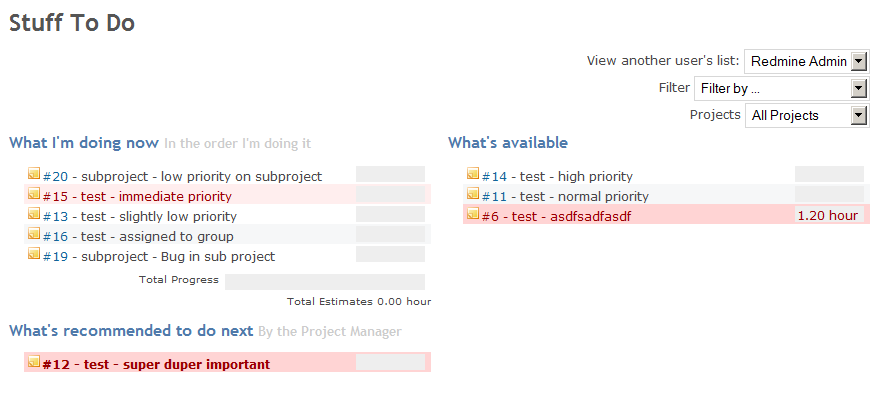

# Redmine Stuff To Do Plugin

The Stuff To Do plugin allows a user to order and prioritize the issues and projects they are doing into a specific order. It will also allow other privileged users to reorder the user's workload.
Master branch supports redmine version 3.x and up. For previous versions use the compatible branches.

## Features

* Sorting and prioritizing of cross-project To Do lists
* Easy to use drag and drop interface
* Editing other user lists for Administrators
* Filtering of issues based on user, priority, or status
* Notification emails based on low workload counts
* Drag and drop time logging using the Time Grid

## Getting the plugin

A copy of the plugin can be downloaded for original versions from [Little Stream Software](https://projects.littlestreamsoftware.com/projects/redmine-stuff-to-do/files) or for newer versions from [GitHub](http://github.com/neffets/redmine-stuff-to-do-plugin). 

## Installation and Setup

1. Follow the Redmine plugin installation steps at: http://www.redmine.org/wiki/redmine/Plugins
   * for redmine>=2.x/>=rails3: Make sure the plugin is installed to: *plugins/stuff_to_do_plugin*
2. Run the plugin migrations
   * for redmine>=2.x/>=rails3: *rake redmine:plugins:migrate*
3. Restart your Redmine web servers (e.g. mongrel, thin, mod_rails)
4. Login and configure the plugin (Administration > Plugins > Configure)
5. Setup permissions
  1.  Use Stuff to Do - allow a user to manage their own Stuff to Do list
  2. View Others Stuff to Do - allow a user to view the Stuff to Do list of their assignees (set in account/user settings)
  3.  View all users stuff to do - view the stuff to do of all users, even if they are not your assignee
  4.  Manage Stuff to Do Reportees - allow a user to select whose Stuff to Do list they can view
  5.  View All Reportee Issues - when viewing another's stuff to do list, view all available issues, even if they would not normally be visible to the current user
  6.  View All Reportee Stuff to Do - when viewing another's stuff to do list, view all issues that are currently in their Doing Now and Recommended lists
6. Click the Stuff To Do link in the top left menu

## Usage

There are three panes that can be sorted:

### What I'm doing now

This pane lists the next 5 items a user is supposed to be working on.  These items should be the *most* important things assigned to the user.  As the user closes an item, the items lower in the list will rise up and fill in this pane.  Items are closed by either closing the issue (Issues) or archiving a project (Project)

### What's recommended to do next

This pane lists extra items for the user.  These items are used as overflow for the What I'm doing now.

### What's available

This pane lists all the open issues that are assigned to the user or the projects visible to the user.  They are the pool of things that a user can draw on as they work.

### Time grid

TODO: describe the "time_grid" feature

### Workflow

The standard workflow for this plugin is as follows:

1. A user will drag items from the What's Available pane to the What I'm doing now and What's recommended to do next
2. Once several items have been dragged the user would prioritize and sort the items in order of importance
3. The user would use the rest of Redmine and work on the #1 item
4. Once the #1 item is complete (or blocked) the user would continue and work on the #2 item

If the user is an Administrator, they have the permission to edit other users' lists.  This allows them to act as the system Project Manager.

## License

This plugin is licensed under the GNU GPL v3.  See COPYRIGHT.txt and GPL.txt for details.

## Project help

If you need help you can contact the maintainer at his email address (See CREDITS.txt) or comment on github. If You are a developer feel free to fork und pull Your changes on github.

